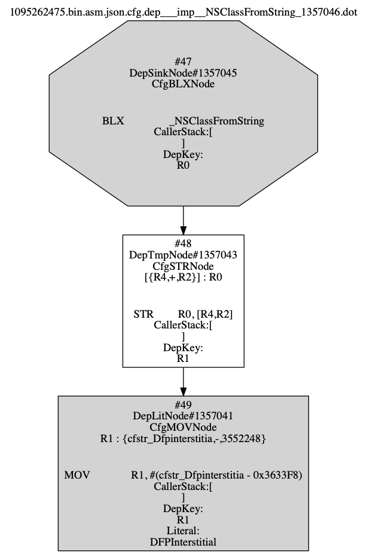
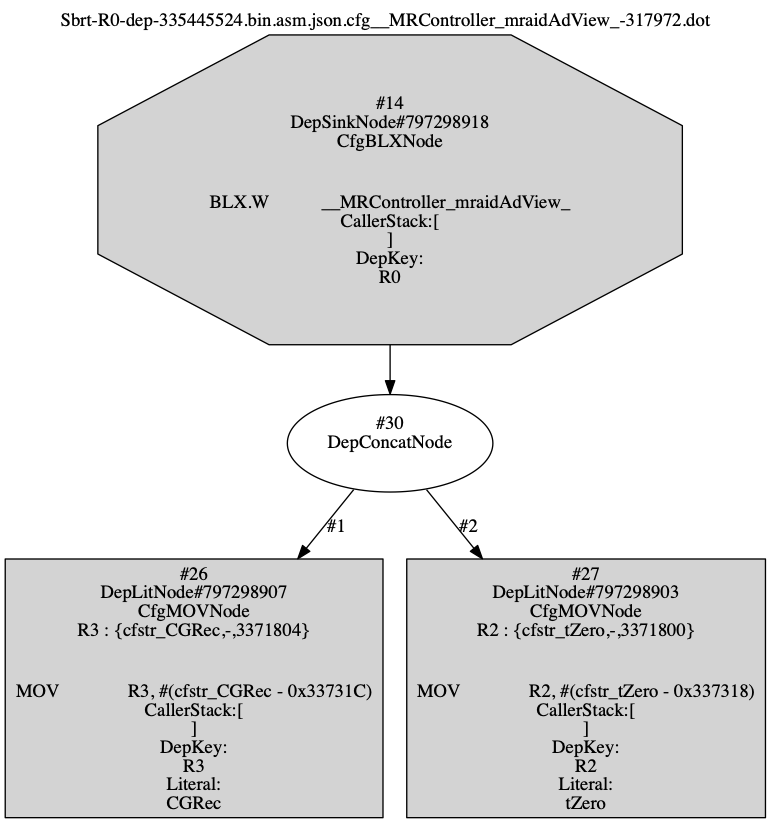
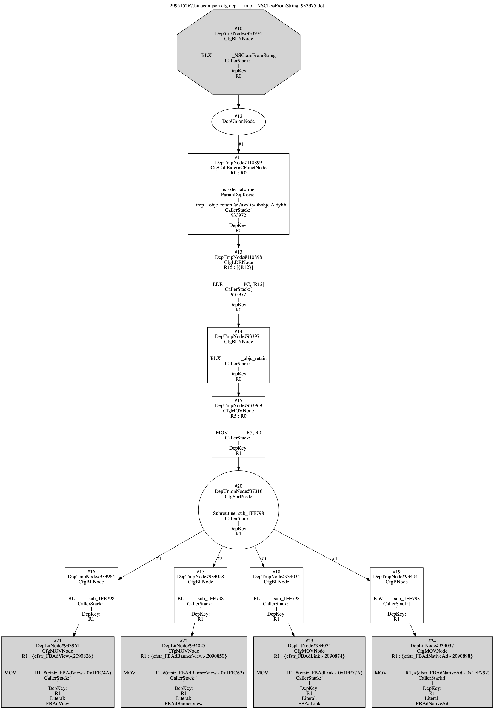
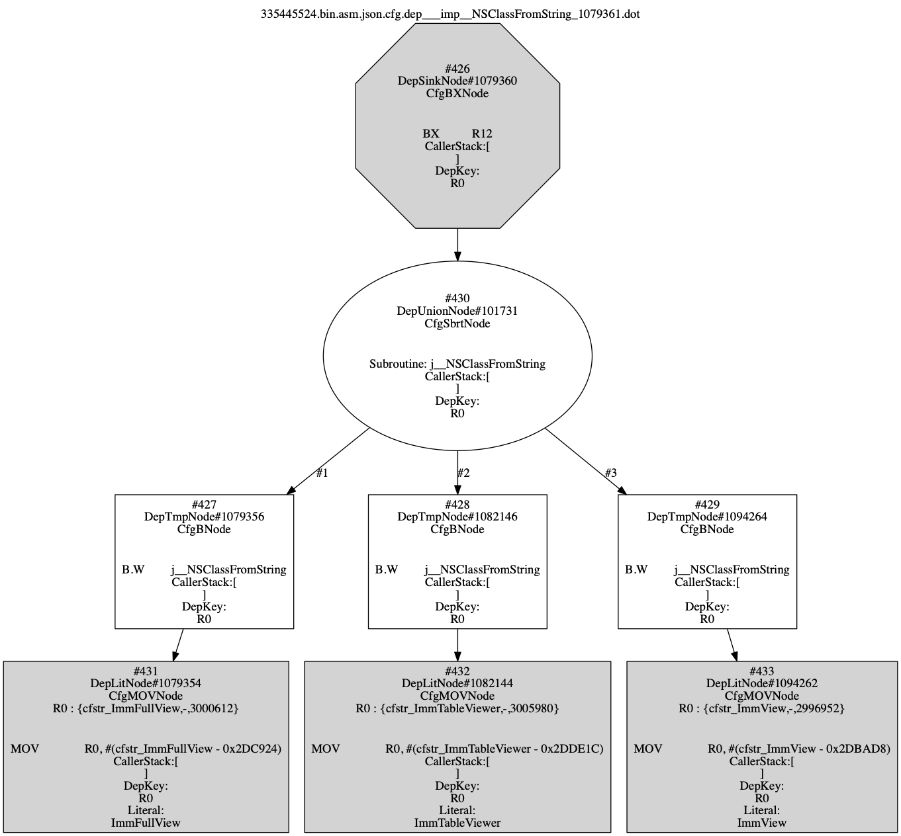

# Static Ad Fraud Detection on iOS Applications

## About 

This GitHub provides the scripts and the configure file to run Static Ad Fraud Detection on iOS executables.

* The Analyzer
	
	The scripts in the Analyzer folder can be used to reproduce our analysis results.  Below is the step to start for the control flow analysis and dependency analysis on iOS executables. 
	To clone binflow scripts, the command is:
	
	```sh
	git clone https://github.com/T-rain/detect-adfraud.git	
	```
	
	Under the folder detect-adfraud, the help command shows how to execute each part of our analysis:

	```sh
	./Analyzer/bin/binflow -h
	
	usage: binflow
	 -c,--cfg <arg>       generate control-flows graph from json file
	 -C,--charset <arg>   charset, default is utf-8
	 -d,--dpg <arg>       dependency graph from cfg
	 -g                   output as Graphviz *.dot graph format
	 -h,--hint <arg>      draw call hint edge on graph
	 -o,--output <arg>    specific output file path
	 -p,--preproc <arg>   preprocess assembly to json file
	 -P,--propchk <arg>   check property violate from dependency graph
 	```
 
## Data

[The Generated JSON Files(Extracted segment information)](http://soslab.nccu.edu.tw/binflowjson)

## Control Flow Graph Construction

We will first construct the control flow graph (CFG) for each App with their Extracted segment information. During the CFG construction, we also mark dependency relations of registers for each assembly statement. we will check call-external-C-function-node , call-external-method-node and call-sbrt-node to detect the Ad fraud.

### Example  

Here is a sample result of [Control Flow Graph](https://drive.google.com/drive/folders/1-OzaXvSFnUzi2z7KqI4ds9vWOjnvHguY?usp=sharing)

### Command

```
./Analyzer/bin/binflow -c ./testSink/1212123.bin.asm.json -g 
```

### Input

A json file that integrates the extracted segment infomration of an assembly

1. {Serial id}.asm.json

### Output

The outputs of cfg are in two formats: 1) an internal format that serializes the cfg objects in binflow and 2) a dot format to generate a visualized figure [Graphviz](https://www.graphviz.org/)

1. {Serial id}.asm.json.cfg
2. {Serial id}.asm.json.cfg.dot

---

## Adinterstitial

We will detect Interstitial-Violate Ad fraud in this section. Our system can dynamically detect specific interstitial API provided by the Ad network by using static analysis to prevent such Interstitial-Violate Ad fraud.

### Command

```
./Analyzer/bin/binflow -s adinterstitial -n record.txt -a ad -f XXX.cfg

./Analyzer/bin/binflow -s DepCheck -P {app_id}.asm. json.cfg.dep.___imp__{adinterstitial}_{dep_id}.dep

```

### Input 

A binflow internal file that serializes cfg objects of the assembly

1. {Serial id}.asm.json.cfg

### Output 

The adinterstitial outputs of sdgs are in two formats: 1) an internal format for string analyis, 2) a dot format to generate a visualized figure and 3) report result

1. {app_id}.asm. json.cfg.dep.___imp__{adinterstitial}_{dep_id}.dep
2. {app_id}.asm.json.cfg.dep.___imp__ {adinterstitial}_{dep_id}.dot
3. result.txt

### Example


---

## AdSize

We will detect Size violation Ad fraud in this section. Our system can dynamically detect the Ad view function (which is used for setting the Ad size) and check if the Ad size is CGRectZero.

### Command

```
./Analyzer/bin/binflow -s adsize -n record.txt -a ad -f XXX.cfg

./Analyzer/bin/binflow -s DepCheck -P {app_id}.asm. json.cfg.dep.___imp__{adinterstitial}_{dep_id}.dep

```

### Input 

A binflow internal file that serializes cfg objects of the assembly

1. {Serial id}.asm.json.cfg

### Output 

The adsize outputs of sdgs are in two formats: 1) an internal format for string analyis, 2) a dot format to generate a visualized figure and 3) report result

1. {app_id}.asm. json.cfg.dep.___imp__{adinterstitial}_{dep_id}.dep
2. {app_id}.asm.json.cfg.dep.___imp__ {adinterstitial}_{dep_id}.dot
3. result.txt

### Example


---

## AdNumber

We will detect Multi-view violation Ad fraud in this section. Our system will detect Multi-view violation by checking if there exist multiple AddSubView functions (an API to attach view) to add ad view in one View Controller (which is a component representing a view of an App).

### Command

```
./Analyzer/bin/binflow -s adnumber -n record.txt -a ad -f XXX.cfg
```

### Input 

A binflow internal file that serializes cfg objects of the assembly

1. {Serial id}.asm.json.cfg

### Output 

The adnumber report result will be writed in the `record.txt`


### Example
| id  | type | nodeId | times | isDetect | controller | adNode |
|---|---|---|---|---|---|---|
| 1095262475.bin.asm.json.cfg  | CfgSbrtNode  | 92818 | 2 | true | SCMosaicViewController |SCMosaicViewControllerAdView |
| 1095262475.bin.asm.json.cfg |  CfgSbrtNode  | 107007 | 0 | true | RevMobVideoViewController |RevMobVideoViewControllerAdView |
| 299515267.bin.asm.json.cfg |  CfgSbrtNode  | 23197 | 2 | true | ViewController | FBAdView |

### Example of adNode



---

## AdOverlay

We will detect Overlay-view violation Ad fraud in this section. Our system will detect Overlay-view violation Ad fraud by checking if an Ad view and a full view are attached in the same View Controller.

### Command

```
./Analyzer/bin/binflow -s adoverlay -n record.txt -a ad -f XXX.cfg
```

### Input 

A binflow internal file that serializes cfg objects of the assembly

1. {Serial id}.asm.json.cfg

### Output 

The adoverlay report result be writed in the `record.txt`

### Example

| id  |  type | nodeId |  isDetect | controller | node  | Unknown Expression |
|---|---|---|---|---|---|---|
| 1095262475.bin.asm.json.cfg  |  CfgSbrt | 774341 | true | SCViewController | SCViewControllerAdView | union(unknown("COULD_BE_EXTERN_METHOD_RETURN_VALUE"-774229)) |
| 335335524.bin.asm.json.cfg  |  CfgSbrt | 104901  |   true | ImmViewController | ImmAdView | NoExpression |
| 335335524.bin.asm.json.cfg  |  CfgSbrt | 104901  |   true | ImmViewController | ImmFullView  | NoExpression |

### Example of fullNode



---


## More Information

* [The Generated Assembly, CFGs, SDGs of Some Sampled Apps](http://140.119.19.247:10988/s/DvFqqO9bTiPx5LC)  

* [BinFlow: Static Detection of API Call Vulnerabilities in iOS Executables](https://github.com/soslab-nccu/binflow)
