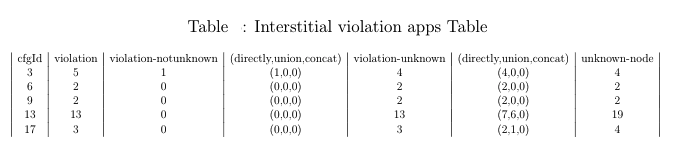
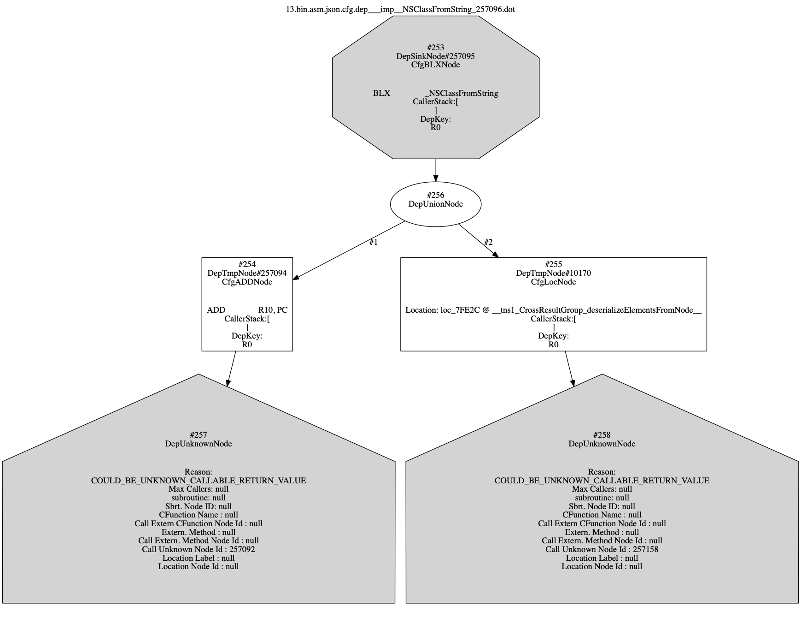
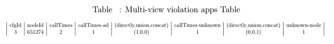
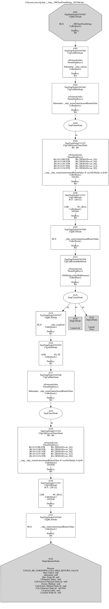
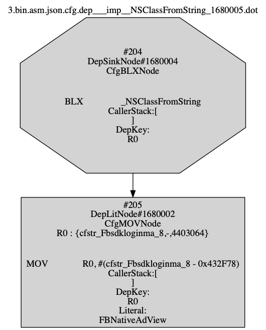

We download the apps from [Pirate App Store](https://iphonecake.com/), we get the several applications from the app list of each genre. We extract the binary of the apps. The binary can be analyzed with disassembler tools(IDA Pro). We generate the assembly, segment information and control flow graph for each app. Then we use our Ad fraud detection analysis to detect if the apps violate Ad fraud.

Following is the result:

We find 5 apps violate Interstitial violation Ad fraud and 1 app violates Multi-view violation Ad fraud within 22 apps. We will present the information about the violation with table and pictures. We also provide the app list through this [folder link](https://drive.google.com/drive/folders/16eQnRMmlhle0VXuklvnkhr-CpUMYtH-l?usp=sharing)

### Interstitial violation Ad fraud Results
[Link](https://github.com/nccumis106036/applist/tree/master/inter)

### Interstitial violation Ad fraud Table

### Interstitial violation Ad fraud Dependency Graph

### Multi-view violation Ad fraud Results
[Link](https://github.com/nccumis106036/applist/tree/master/multi)

### Multi-view violation Ad fraud Table

### Multi-view violation Ad fraud Dependency Graph

